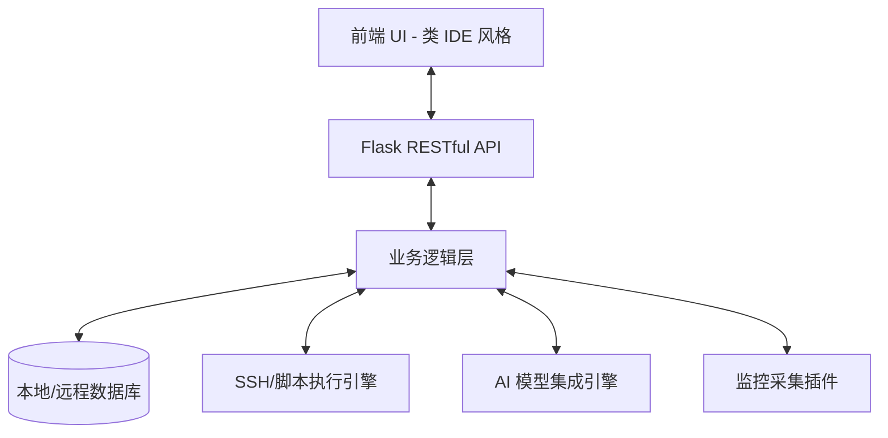

# Nexus 智能运维管理平台系统设计文档

## 1. 项目概述
**Nexus** 是一款专为 Windows 平台打造的现代化智能运维（AIOps）工具。它集成了传统运维管理、实时监控审计、知识沉淀以及前沿的 AI 辅助能力。Nexus 旨在为运维人员提供一个类 IDE（如 Trae/VS Code）的沉浸式工作环境，通过集成的 AI 助手简化复杂的运维任务。

## 2. 系统架构设计
### 2.1 技术栈 (Technical Stack)
- **后端框架**: Python Flask (提供 RESTful API 及后台逻辑处理)
- **前端架构**: 现代化 Web 技术（HTML5, Vanilla CSS, JavaScript），利用 **Webview2** 或 **PyWebView** 在 Windows 窗体中嵌入渲染。
- **数据持久化**: SQLite (本地轻量化存储) 或 PostgreSQL (企业级远程连接)。
- **打包集成**: PyInstaller + Inno Setup (支持 Windows 一键下载并安装 exe)。
- **通信协议**: SSH (用于远程执行), WebSocket (用于实时监控数据推送)。

### 2.2 核心架构图 (Architecture Overview)

## 3. 功能模块详细设计

### 3.1 自动化任务 (Automation Tasks)
- **服务器管理**: 支持服务器资产的录入、分组及状态检测。使用**网格化节点卡片系统**替代传统列表，显著提升大规模资产的操作体验。
- **远程执行**: 集成终端窗口，支持对多台主机批量执行命令。集成 **“全选”逻辑** 与执行进度实时反馈。
- **脚本管理**: 自定义脚本库，采用 **Grid-based 卡片布局**，支持 Python, Shell, PowerShell 等常用脚本，集成快速执行入口。
- **文件分发**: 高效的文件上传与分发机制，具备**现代化上传拖拽区域**，支持断点续传。
- **定时任务**: 基于 Crontab 的自动化任务调度系统。任务状态通过 **状态开关 (Switch)** 实时控制。
- **系统巡检**: 定期自动执行健康检查脚本，输出包含 **SVG 环形图表 (Doughnut Chart)** 与 **高质感状态勋章 (Badges)** 的巡检报告。

### 3.2 监控审计 (Monitoring & Audit)
- **监控中心**:
    - **多维监控**: 涵盖服务器、核心应用、数据库、容器。
    - **全链路拓扑**: 可视化展示应用间的调用链及依赖关系。
    - **业务指标**: 自定义监控面板，实时展示核心业务健康度。
- **报表统计**: 自动生成各服务器及其组件的资源占用、在线率等统计分析。

### 3.3 知识中心 (Knowledge Center)
- **知识库**: 结构化存储运维文档、故障处理流程及最佳实践。
- **编辑器**: 集成高性能代码/文档编辑器（类似 VS Code 的 Monaco Editor），支持 Markdown 和代码高亮。

### 3.4 系统管理 (System Management)
- **系统设置**: 用户偏好、全局变量、数据源配置。
- **告警设置**: 灵活的告警阈值配置，支持邮件、短信、钉钉/企业微信推送。

### 3.5 AI 智能助手 (AI Copilot)
- **模型设置**: 支持接入多种大模型（GPT-4, Claude, Llama 等），允许用户配置 API Key 及 Base URL。
- **智能对话**: 类 Trae 风格的侧边栏对话框，支持运维知识问答、脚本自动生成、日志异常自动分析。

## 4. UI/UX 风格设计规范
> [!NOTE]
> 界面设计深度参考了 **Trae IDE** 的视觉语言，并引入了 **“极致冷色系 (Hyper-Cool)”** 的深色模式美学。

### 4.1 布局方案 (Layout)
- **左侧导航栏**: 极窄设计，包含资源管理器、自动化任务、监控看板、知识库等图标。
- **中间主控区**: 
    - **欢迎屏幕 (Welcome Screen)**: 集成**动态终端 Logo (Blinking Cursor)** 与 **3D 物理质感快捷键 (kbd Style)**。
    - **多标签页 (Tabs)**: 支持同时开启多个终端、文档编辑器或监控仪表盘，具备完美的沉浸式焦点管理。
- **右侧 AI 面板**: 可常驻或隐藏的 AI Chat 区域，支持上下文理解（Context-aware）。
- **底部状态栏**: 显示当前连接数、告警统计、系统资源消耗。

### 4.2 视觉要素 (Visual Elements)
- **磨砂玻璃效果 (Glassmorphism)**: 全站核心面板（如 AI 侧边栏、快捷键卡片、巡检看板）采用 **Backdrop-blur (20px+)** 与半透明背景。
- **设计细节**: 
    - 使用 **HSL 调和色彩** 以消除视觉疲劳。
    - **阴影与发光 (Glow)**: 关键状态与图标具备微妙的霓虹发光效果，增强科技感。
    - **物理化按键**: 快捷键采用 3D 阴影圆角设计，模拟真实机械轴体手感。

## 5. 安全与可扩展性
- **审计记录**: 所有敏感操作（重启、高权限命令）强制记录。
- **凭证加密**: 所有服务器 SSH 密钥与 API Key 均采用 AES-256-GCM 硬件级加密存储。
- **插件化**: 支持导出/导入自定义运维工具包，提高系统扩展能力。

---
*Nexus - 为运维注入智能动力*
